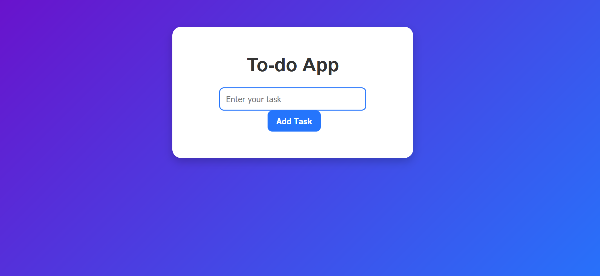
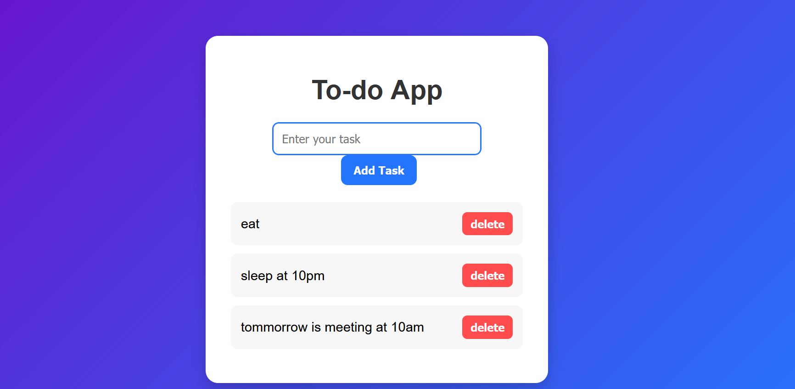

# ✅ To-Do App

A simple and stylish **To-Do List Application** built with **HTML, CSS, and JavaScript**.  
You can add tasks, delete them, and manage your daily activities with a clean UI.

---

## 📂 Project Structure

├── index.html # Main HTML file
├── style.css # Styling file
├── todo.js # JavaScript functionality
├── todotask.png # Screenshot - tasks added
├── todofrontview.png # Screenshot - front view

## 🚀 Features

- ➕ Add new tasks  
- ❌ Delete tasks  
- 🎨 Modern UI with gradient background & hover effects  
- ⚡ Smooth, responsive design  
- 💻 Works on all browsers  

---

## 🖥️ How to Run

1. Clone or download this repository.
2. Make sure all three files (`index.html`, `style.css`, `todo.js`) are in the same folder.
3. Open `index.html` in any browser.
4. Start adding and deleting tasks 🎉

---

## 📸 Screenshots

### 📝 Front View (Empty State)

### ✅ Tasks Added

---

## 🛠️ Technologies Used

- **HTML5** – Structure  
- **CSS3** – Styling and Layout  
- **JavaScript (Vanilla JS)** – Functionality  

---

## 📌 Future Improvements

- ✅ Mark tasks as completed (strike-through)  
- ✅ Save tasks in local storage  
- 📊 Task counter (pending & completed)  
- 🌙 Dark/Light mode toggle  

---

👩‍💻 Developed by **Aishwarya Santosh Shinde**

